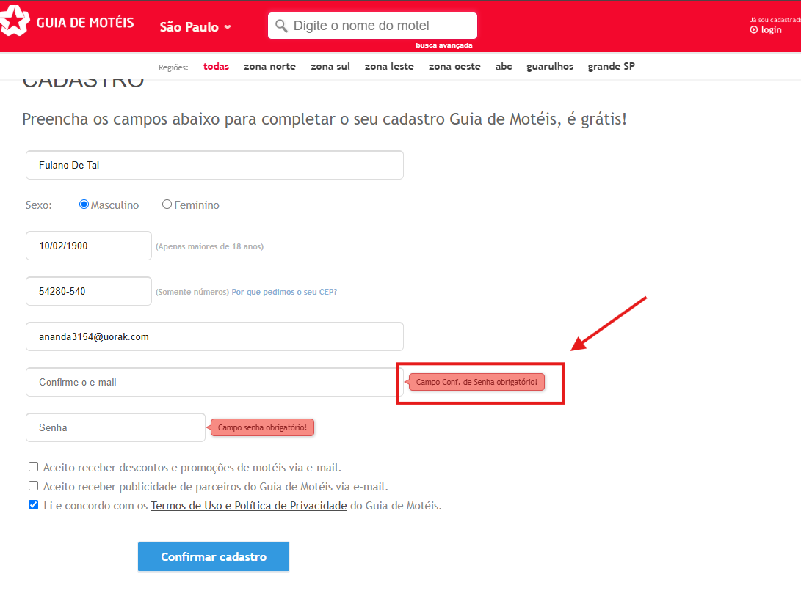
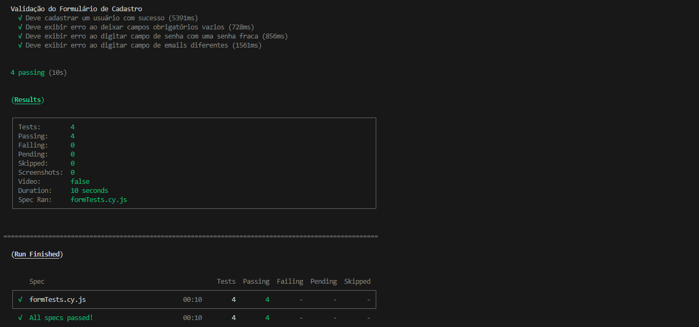
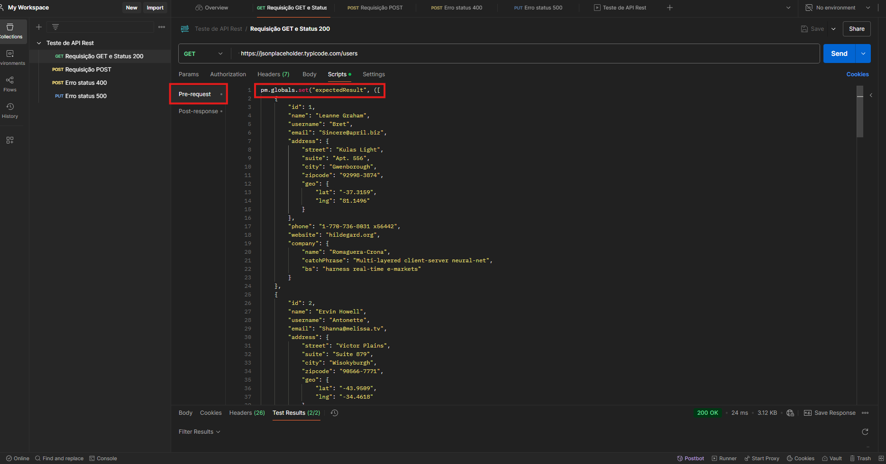
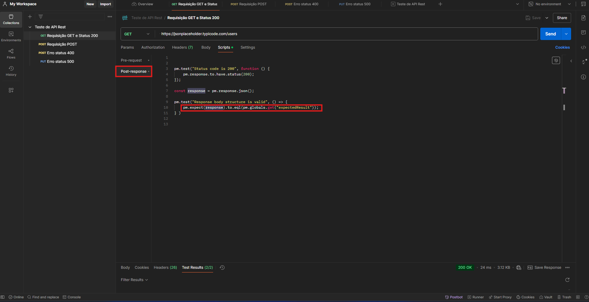
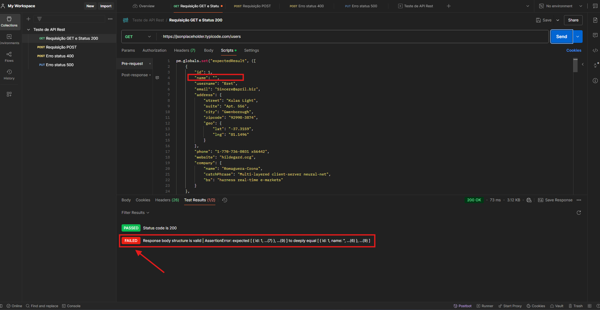
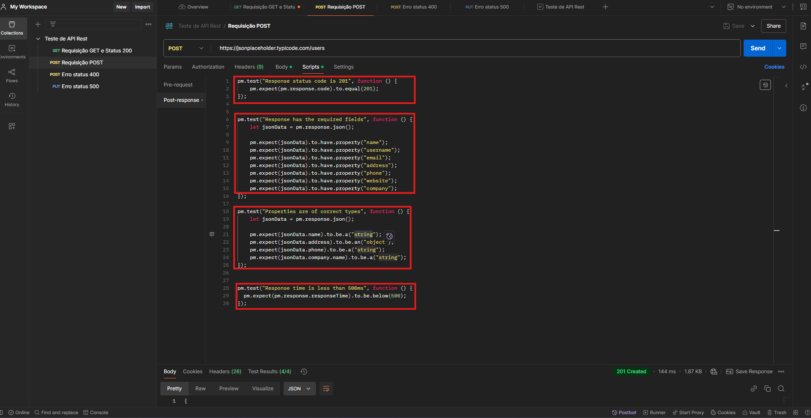
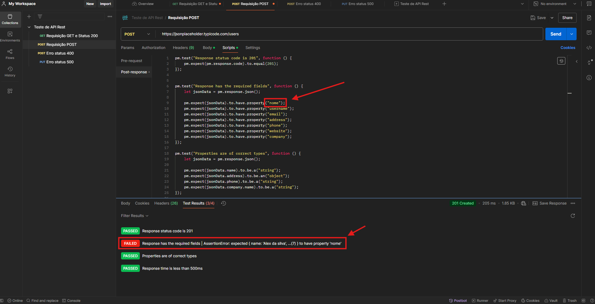
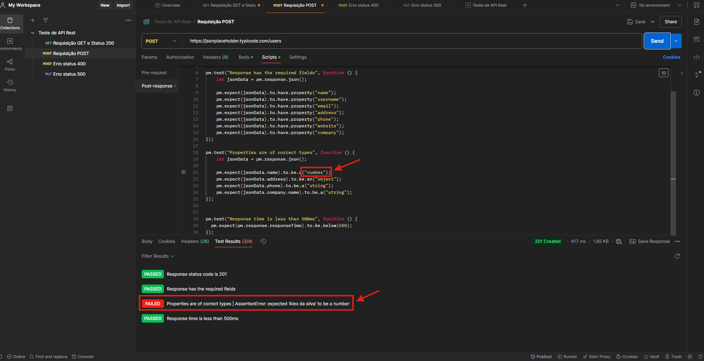
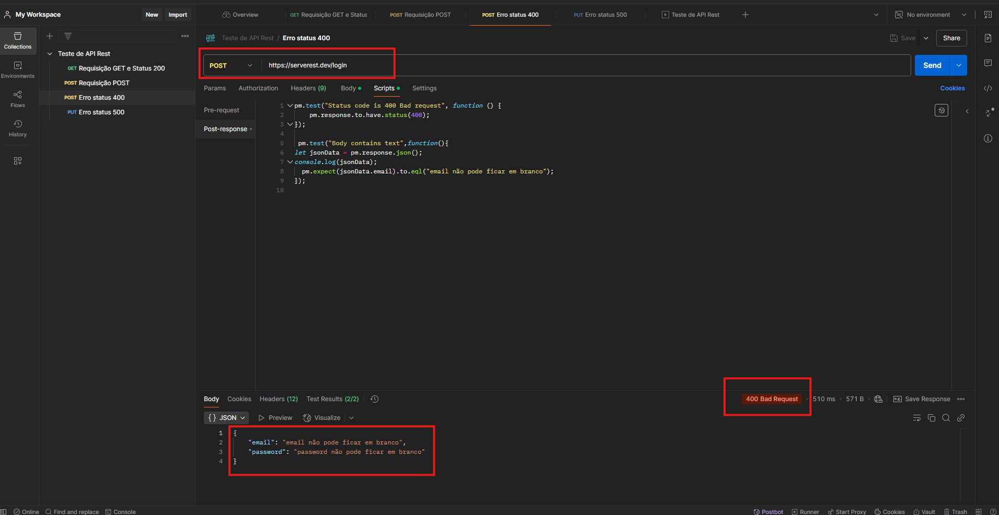
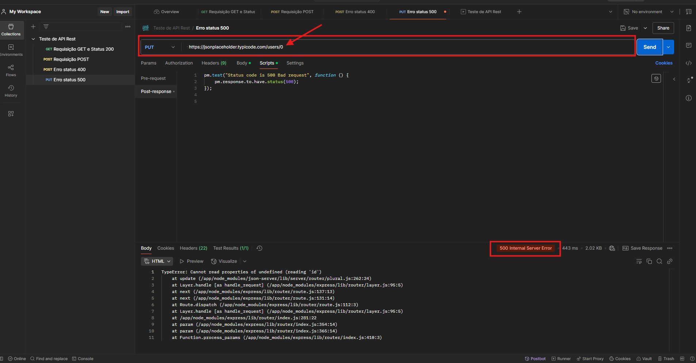

# Teste-QA

Teste de automatização para vaga de QA pleno.

## Pre-requisitos

É necessário ter o Node.js e o npm instalados para rodar este projeto.

> Eu usei as versões `v18.11.0` do Node.js e `8.19.2` do npm, respectivamente. Sugiro que utilize as mesmas versões ou versões posteriores.

## Instação

Execute `npm install` (ou `npm i` para a versão abreviada) para instalar as dependências de desenvolvimento.

## Testes

> **Nota:** Antes de rodar os testes, faça uma cópia do arquivo `cypress.env.example.json` como `cypress.env.json`, que no mundo real você atualizaria com credenciais válidas.

> O arquivo `cypress.env.json` está incluído no [`.gitignore`](./.gitignore) e você pode ficar tranquilo sabendo que informações confidenciais não serão versionadas.

Execute  `npm test` para rodar o teste no modo headless.

Ou, execute `npm run cy:open` para abrir o Cypress no modo interativo.

Para testar uma nova conta por favor colocar um email novo em gerador de emails no campo "const email" no diretorio e2e/formTests.cy.js, mas coloquei uma verificação, para caso o usuário já tenha uma conta ele não quebra o teste;

## Observação 
Tomei a liberdade de testar o formulário do site de vocês e percebi um detalhe, quando estava automatizando os campos, que é o Campo "Confirme o e-mail" quando ele está vazio contem um texto errado na mensagem de ERRO "Campo Conf. de Senha obrigatório!" o correto seria "Campo Conf. de E-mail obrigatório!".

## Aqui você encontrará o relatório com os resultados dos testes

## TESTE DE UI
Teste automatizado efetuado seguindo os requisitos iniciais
1- Preencher o formulário corretamente e enviar → Deve exibir mensagem de sucesso.
2- Deixar campos obrigatórios vazios → Deve exibir mensagens de erro.
3- Digitar uma senha fraca (exemplo: "12345") → Deve exibir erro de validação.
4- Digitar e-mails diferentes nos campos de "E-mail" e "Confirmação de E-mail" → Deve exibir erro.

Imagens 

## TESTE DE API REST

## Requisição GET
- Utilizei o Postman para fazer as requisições e a automatização da API 
- Fiz Requisição com o metodo GET com Status 200 e criei um pré-request com o body da API original chamada 'expectedResult' para verificar se o Body de request é o mesmo body de response garantindo que todos os dados vieram com sucesso, se faltar alguma informação o teste falha.

pré-request

response

Erro se faltar alguma informação

### Requisição POST
- Verifiquei o status 201 Created;
- Verifiquei se a resposta possui os campos "obrigatórios";
- Verifiquei se as propriedades tinham os tipos corretos;
- Verifiquei o tempo de resposta.

Requisição POST

Erro campos "obrigatórios"

Erro tipos corretos

### Status 400 
- Erro 400 mandei uma requisição com método Post, porem com valores obrigatórios do body faltando o que gerou Erro 400
- Utilizei uma APi diferente, pois a API jsonplaceholder mesmo que mande o body vazio ele aceita.

Erro status 400

### Status 500
- Erro 500 mandei uma requisição PUT com o valor 0 (Zero) no endpoint, pois não existe id= 0 na API o que retorna erro 500 internal server
Erro status 500

